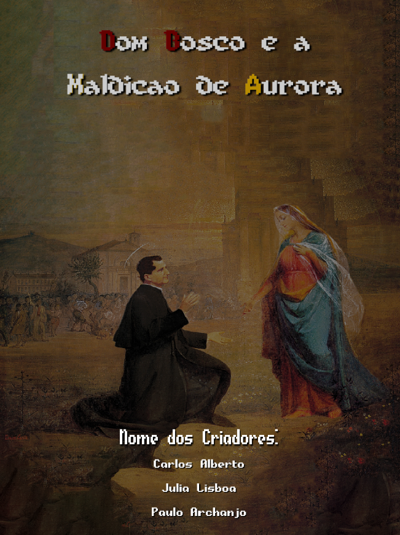

# dom-bosco-mobile-game

Este Projeto trata-se de um jogo, feito no período do curso técnico em Informática.

Criado por Carlos Alberto, Julia Lisboa e Paulo Archanjo.

Link para download do Apk do projeto: [https://drive.google.com/file/d/1JZ77-xh157W89nL4TzZ_OHeEAVrv88iB/view?usp=sharing](https://drive.google.com/file/d/1uW8XVyL4zOmWZcqTuAIALEtXITC57GDx/view?usp=drive_link)

##

  O jogo desenvolvido chama se Dom Bosco e a Maldição de Aurora, nele 
o usuário terá uma história apresentada e três fases desenvolvidas com o 
objetivo de entreter e divertir o usuário. Nas fases do jogo, o usuário terá de clicar 
nos anjos que forem aparecendo, se acabar clicando na criatura o usuário 
perdera o jogo e retornará para o início, a pessoa terá que ter o maior número 
de score para ir avançando de fase e vencer o jogo.
Conforme o jogo vai avançando a dificuldade de clicar nos personagens 
para vencer também vai aumentando, com isso gera o entusiasmo para vencer 
o jogo.  

##

Dom Bosco e a Maldição de Aurora é um jogo baseado em uma maldição 
que assola a cidade, onde Dom Bosco foi enviado para realizar uma missa no 
local. 
Terá um menu inicial com duas opções, “jogar” e “sair”, jogar inicia a 
história do jogo e manda para a fase 1, a opção sair fecha o jogo. Quando o 
usuário chegar ao score 27 ele avança para a história da fase 2 e em seguida 
encaminhado para a fase 2, quando atingir o score 60 ele avança para a história 
da fase 3 e logo para a fase 3, por fim quando chegar ao score 100 o usuário 
finaliza o jogo e é encaminhado para os créditos.

Para mais informações, a documentação do projeto está disponível no repositório.

##

